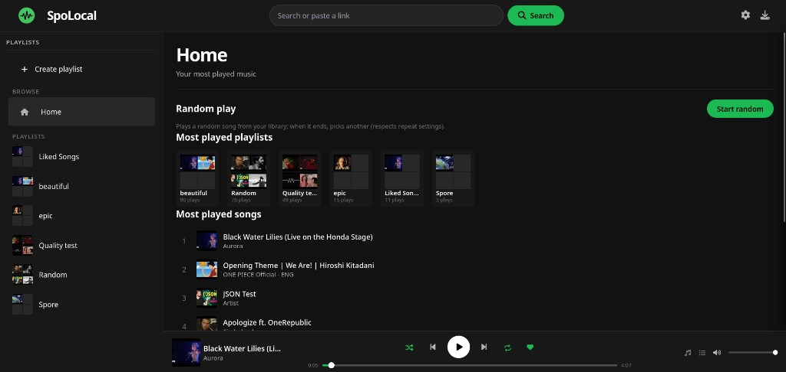
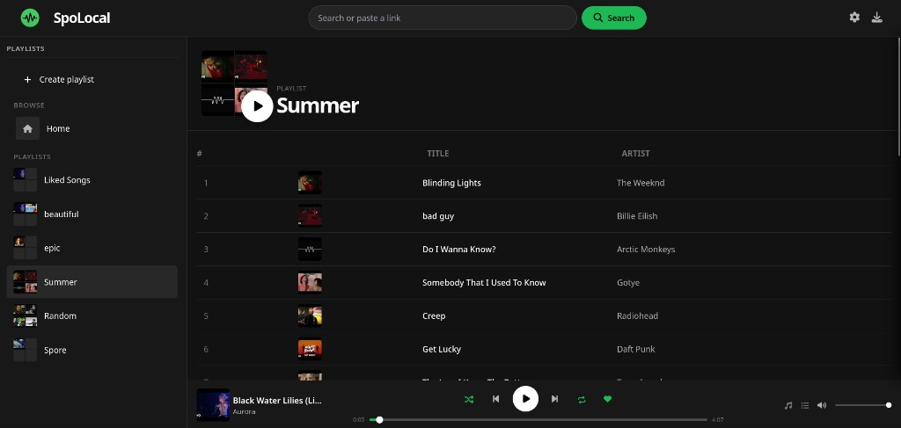
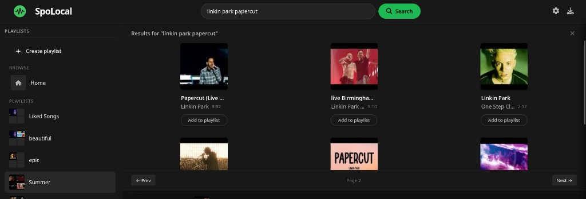
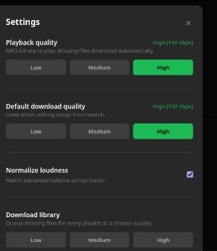
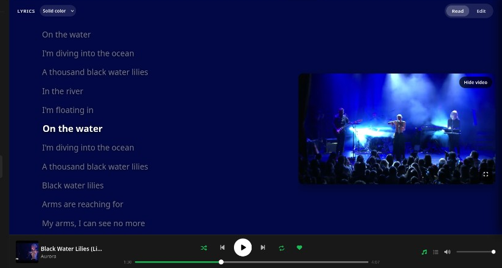
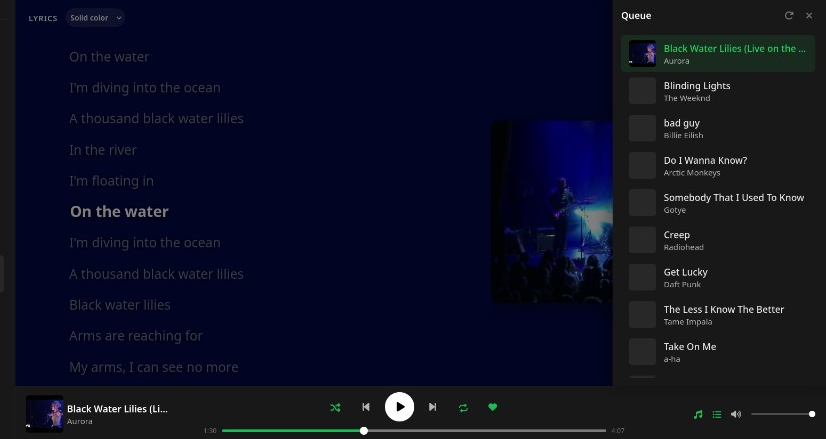
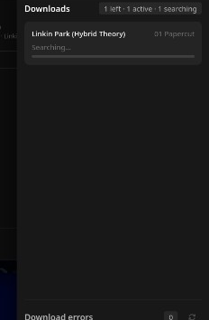

# SpoLocal

Local Spotify-style music downloader and player. Search by Spotify URL, YouTube URL, or plain text; build playlists; download tracks into playlist folders; play them in the browser.

No Spotify API keys required - playlist and track metadata come from public embed pages.

## Screenshots

Home, random play, most-played lists, and the player bar:



Playlists and the track table:



Search (Spotify / YouTube / text) and add to playlist:



Playback quality, download quality, loudness, and library download:



Synced lyrics, optional video, and solid/Milkdrop background:



Up-next queue:



Live download queue:



## Features

- Spotify-style dark UI (FastAPI + Tailwind + vanilla JS)
- Search: Spotify track/playlist URL, YouTube URL, or title/artist
- Manual playlists and Spotify playlist import
- Live download queue with status
- In-browser player with queue, lyrics (LRCLIB), and recommendations
- Docker deployment with optional HTTPS via Caddy
- PWA support (offline shell; build with npm)

## Project layout

```
SpoLocal/
├── spotify_scraper.py      # YouTube download + Spotify embed metadata
├── spotifydown_api.py      # Spotify embed page scraper
├── docker-compose.yml      # App + Caddy reverse proxy
├── Dockerfile
├── webapp/                 # FastAPI app, templates, static assets
│   ├── main.py
│   ├── requirements.txt
│   └── package.json        # Tailwind + PWA build
├── downloads/                # Downloaded audio (gitignored)
└── data/                   # Docker playlist store (gitignored)
```

## Quick start (local)

**Requirements:** Python 3.12+, Node.js 18+ (20+ recommended), ffmpeg on PATH (or the local `ffmpeg-*` bundle on Windows).

```bash
cd webapp
python -m venv .venv
source .venv/bin/activate          # Windows: .venv\Scripts\activate
pip install -r requirements.txt
npm install
npm run build
uvicorn main:app --reload --port 8000
```

Open http://127.0.0.1:8000

**Windows shortcut:** run `run_spolocal.bat` from the repo root (expects `webapp\.venv`).

### CSS / PWA builds

```bash
cd webapp
npm run build:css    # Tailwind → static/app.css
npm run build:pwa    # Vite → static/pwa/ (gitignored; run after clone)
npm run build        # both
npm run watch:css    # dev auto-rebuild
```

Optional env vars: copy `webapp/.env.example` → `webapp/.env`.

## Docker

From the repo root:

```bash
docker compose build
docker compose up
```

Open http://127.0.0.1:8000 — downloads persist in `./downloads`, playlists in `./data/webapp_playlists.json`.

The image builds the PWA bundle internally. On the host, `static/pwa/` is optional unless you run without Docker.

## ffmpeg

- **Docker:** system ffmpeg is used automatically.
- **Windows (native):** place an ffmpeg essentials build in `ffmpeg-2026-05-06-git-f2e5eff3ff-essentials_build/bin/` (path is hardcoded in `spotify_scraper.py`), or refactor the scraper to use PATH.

## License

Personal / educational use. Respect copyright and platform terms when downloading content.
