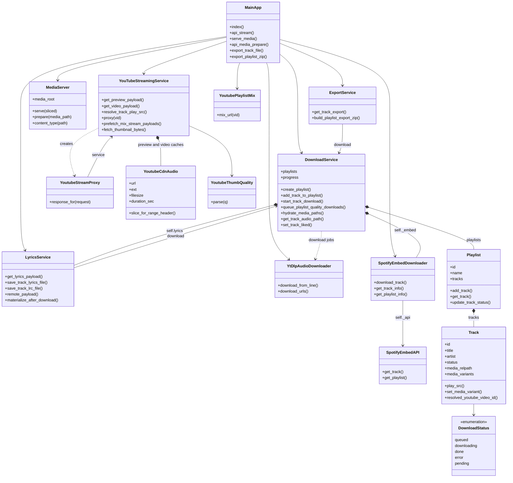
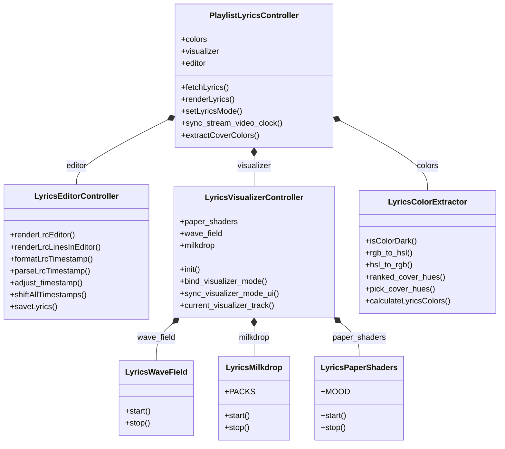

# SpoLocal architecture

Class-level overview of the app. Backend is FastAPI + Python services, frontend is
vanilla JS ES modules (OOP controllers). The two halves talk only over HTTP
(`/api/...`, `/media/...`), so no class in one diagram depends on a class in the
other.

Module-level helpers are not classes and are left out: `audio_quality.py`,
`tag_metadata.py`, `cover_image.py`, `lyrics_files.py`, `lyrics_fetch.py`,
`lyrics_text.py`, `loudness_analysis.py`, and the pydantic request bodies in
`main.py`.

## Backend

`main.py` is a thin router. All work lives in the service classes below.

`DownloadService` also keeps a private hydration cache (`_HydrationCacheEntry`:
stem-to-path map plus lazy albums) that is not shown above.

## Frontend: session and player

`PlaylistSession.mjs` builds `PlaylistPlayerState`, `PlaylistSessionController`,
and the shared `MseStreamController` (exposed as `window.SpolocalMse`).
`PlaylistSessionController` creates every sub-controller and then wires the
cross-references each one needs.

```mermaid
classDiagram
    direction TB

    class PlaylistSessionController {
        +state
        +transport
        +queue
        +lyrics
        +quality
        +home
        +download
        +contextMenu
        +editModal
        +settings
        +trackInfo
        +trackEdit
        +songMix
        +bootstrap()
        +navigatePlaylist()
        +restoreLastPlayback()
    }

    class PlaylistPlayerState {
        +hub
        +currentTrackId
        +audio
        +tracks
        +playingTracks
    }

    class PlaylistTransportController {
        +playLibraryEntry()
        +playTrackById()
        +playAtDelta()
        +toggle_main_play()
        +seek_to_time_from_slider()
        +advance_search_stream()
        +_attach_playback_source()
    }

    class PlaybackQualityController {
        +ensurePlaybackVariantReady()
        +switchPlaybackQuality()
        +apply_track_loudness()
        +replace_audio_src()
    }

    class PlaylistQueueController {
        +render_queue_list()
        +play_track_from_queue_entry()
        +restore_manual_queue_from_storage()
    }

    class MseStreamController {
        +play(vid)
        +play_media(src)
        +seek_to()
        +stop()
        +is_active()
    }

    class AudioNormalizationController {
        +set_track_gain()
        +set_user_volume()
    }

    class SpolocalQualityPrefs {
        +playbackKbps()
        +downloadKbps()
        +resolvePlaybackPlaySrc()
        +normalizeMediaPath()
        +streamFitsTier()
    }

    class SpolocalCoverUrls {
        +trackCoverUrl()
        +youtubeThumbApiUrl()
    }

    class PlaylistLikeController
    class PlaylistShuffleController
    class PlaylistMediaSessionController
    class PlaylistHomeViewController
    class PlaylistLyricsController
    class PlaylistDownloadController
    class PlaylistContextMenuController
    class PlaylistEditModalController
    class SettingsController
    class TrackInfoController
    class TrackEditController
    class SongMixController
    class PlaylistColumnResizer
    class AppShellController {
        +boot()
        +playPreview()
        +stopPreview()
    }
    class SpolocalMobileSheetDrawers

    PlaylistSessionController *-- PlaylistPlayerState : state
    PlaylistSessionController *-- PlaylistTransportController : transport
    PlaylistSessionController *-- PlaybackQualityController : quality
    PlaylistSessionController *-- PlaylistQueueController : queue
    PlaylistSessionController *-- PlaylistLyricsController : lyrics
    PlaylistSessionController *-- PlaylistLikeController : likes
    PlaylistSessionController *-- PlaylistShuffleController : shuffle
    PlaylistSessionController *-- PlaylistMediaSessionController : mediaSession
    PlaylistSessionController *-- PlaylistHomeViewController : home
    PlaylistSessionController *-- PlaylistDownloadController : download
    PlaylistSessionController *-- PlaylistContextMenuController : contextMenu
    PlaylistSessionController *-- PlaylistEditModalController : editModal
    PlaylistSessionController *-- SettingsController : settings
    PlaylistSessionController *-- TrackInfoController : trackInfo
    PlaylistSessionController *-- TrackEditController : trackEdit
    PlaylistSessionController *-- SongMixController : songMix
    PlaylistSessionController ..> AudioNormalizationController : hub.audioNormalization
    PlaylistSessionController ..> PlaylistColumnResizer : init()

    PlaylistTransportController --> PlaybackQualityController : quality
    PlaylistTransportController --> PlaylistQueueController : queue
    PlaylistTransportController --> PlaylistLyricsController : lyrics
    PlaylistTransportController --> PlaylistHomeViewController : home
    PlaylistTransportController --> MseStreamController : window.SpolocalMse
    PlaylistTransportController ..> AudioNormalizationController : hub.audioNormalization
    PlaylistTransportController --> SpolocalQualityPrefs
    PlaybackQualityController --> PlaylistTransportController : transport
    PlaylistQueueController --> PlaylistTransportController : transport
    PlaylistLyricsController --> PlaylistTransportController : transport
    SettingsController --> PlaylistTransportController
    SettingsController --> PlaylistDownloadController
    PlaylistContextMenuController --> PlaylistTransportController
    PlaylistContextMenuController --> PlaylistQueueController
    PlaylistContextMenuController --> SongMixController
    PlaylistContextMenuController --> TrackInfoController
    TrackEditController --> PlaylistTransportController
    PlaylistDownloadController --> PlaylistSessionController : session
    AppShellController ..> MseStreamController : preview playback
    AppShellController *-- SpolocalMobileSheetDrawers
    SpolocalCoverUrls ..> SpolocalQualityPrefs
```

`SpolocalQualityPrefs` and `SpolocalCoverUrls` are a namespace object and a
small class in `audio_quality_prefs.js`, not ES module exports.
`AppShellController` is a classic script booted separately from the module graph
(`window.AppShell.boot()`); it handles the global UI (search, preview,
recommendations) and shares the same `window.SpolocalMse` instance.

## Lyrics subsystem

`PlaylistLyricsController` owns the LRC editor, the background visualizer, and the
palette math extracted from the cover art.

